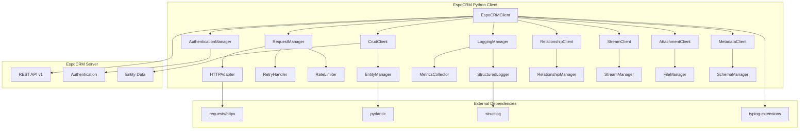

# EspoCRM Python API İstemcisi - Detaylı Geliştirme Planı

## 🎯 Proje Hedefleri

1. **Kapsamlı API Desteği**: Tüm EspoCRM API özelliklerini destekleyen tam özellikli kütüphane
2. **Modern OOP Tasarımı**: SOLID prensiplerine uygun, modüler ve genişletilebilir mimari
3. **Professional Logging**: JSON formatında structured logging ve monitoring entegrasyonu
4. **Type Safety**: Pydantic ile veri validasyonu ve type hints
5. **PyPI Ready**: Profesyonel paket dağıtımı

## 🏗️ Mimari Tasarım



## 📁 Proje Yapısı

```
espocrm-python-client/
├── espocrm/
│   ├── __init__.py
│   ├── client.py                 # Ana EspoCRMClient sınıfı
│   ├── config.py                 # Konfigürasyon yönetimi
│   ├── exceptions.py             # Özel exception sınıfları
│   │
│   ├── auth/
│   │   ├── __init__.py
│   │   ├── base.py              # Base authentication
│   │   ├── api_key.py           # API Key auth
│   │   ├── hmac.py              # HMAC auth
│   │   └── basic.py             # Basic auth
│   │
│   ├── clients/
│   │   ├── __init__.py
│   │   ├── base.py              # Base client sınıfı
│   │   ├── crud.py              # CRUD operasyonları
│   │   ├── relationships.py     # İlişki yönetimi
│   │   ├── stream.py            # Stream işlemleri
│   │   ├── attachments.py       # Dosya yönetimi
│   │   └── metadata.py          # Metadata işlemleri
│   │
│   ├── models/
│   │   ├── __init__.py
│   │   ├── base.py              # Base model sınıfları
│   │   ├── entities.py          # Entity modelleri
│   │   ├── search.py            # Arama parametreleri
│   │   ├── responses.py         # API yanıt modelleri
│   │   └── requests.py          # API istek modelleri
│   │
│   ├── utils/
│   │   ├── __init__.py
│   │   ├── http.py              # HTTP utilities
│   │   ├── serializers.py       # Veri serileştirme
│   │   ├── validators.py        # Veri validasyonu
│   │   └── helpers.py           # Yardımcı fonksiyonlar
│   │
│   └── logging/
│       ├── __init__.py
│       ├── logger.py            # Structured logger
│       ├── formatters.py        # Log formatters
│       ├── handlers.py          # Log handlers
│       └── metrics.py           # Metrics collection
│
├── tests/
│   ├── __init__.py
│   ├── conftest.py              # Pytest konfigürasyonu
│   ├── test_client.py           # Ana client testleri
│   ├── test_auth/               # Authentication testleri
│   ├── test_clients/            # Client modül testleri
│   ├── test_models/             # Model testleri
│   ├── test_utils/              # Utility testleri
│   ├── test_logging/            # Logging testleri
│   └── integration/             # Entegrasyon testleri
│
├── examples/
│   ├── basic_usage.py
│   ├── advanced_search.py
│   ├── file_operations.py
│   ├── stream_operations.py
│   └── bulk_operations.py
│
├── docs/
│   ├── index.md
│   ├── installation.md
│   ├── quickstart.md
│   ├── authentication.md
│   ├── api_reference/
│   └── examples/
│
├── pyproject.toml               # Modern Python packaging
├── setup.py                     # Backward compatibility
├── requirements.txt             # Temel bağımlılıklar
├── requirements-dev.txt         # Geliştirme bağımlılıkları
├── README.md
├── CHANGELOG.md
├── LICENSE
└── .github/
    └── workflows/
        ├── tests.yml
        ├── publish.yml
        └── docs.yml
```

## 🔧 Temel Bileşenler

### 1. Ana Client Sınıfı
```python
class EspoCRMClient:
    """Ana EspoCRM API istemcisi"""
    
    def __init__(
        self,
        base_url: str,
        auth: AuthenticationBase,
        config: Optional[ClientConfig] = None,
        logger: Optional[StructuredLogger] = None
    ):
        # Modüler client'ları başlat
        self.crud = CrudClient(self)
        self.relationships = RelationshipClient(self)
        self.stream = StreamClient(self)
        self.attachments = AttachmentClient(self)
        self.metadata = MetadataClient(self)
```

### 2. Authentication Sistemi
- **API Key Authentication**: En basit yöntem
- **HMAC Authentication**: En güvenli yöntem  
- **Basic Authentication**: Geriye dönük uyumluluk
- **Token Management**: Otomatik token yenileme

### 3. Structured Logging
```python
{
    "timestamp": "2025-01-02T14:48:00Z",
    "level": "INFO",
    "logger": "espocrm.client.crud",
    "message": "Creating new Lead record",
    "context": {
        "method": "POST",
        "endpoint": "/api/v1/Lead",
        "request_id": "req_123456",
        "user_id": "api_user_001",
        "execution_time_ms": 245
    },
    "data": {
        "entity_type": "Lead",
        "fields": ["firstName", "lastName", "emailAddress"]
    }
}
```

### 4. Pydantic Modelleri
```python
class SearchParams(BaseModel):
    """API arama parametreleri"""
    offset: Optional[int] = 0
    max_size: Optional[int] = 20
    where: Optional[List[WhereClause]] = None
    order_by: Optional[str] = None
    order: Optional[Literal["asc", "desc"]] = "asc"
    select: Optional[List[str]] = None

class EntityRecord(BaseModel):
    """Temel entity kaydı"""
    id: Optional[str] = None
    created_at: Optional[datetime] = None
    modified_at: Optional[datetime] = None
    
    class Config:
        extra = "allow"  # Dinamik alanlar için
```

## 🚀 Geliştirme Aşamaları

### Faz 1: Temel Altyapı (1-2 hafta)
1. **Proje yapısını oluştur**
2. **Authentication sistemini geliştir**
3. **Base client ve HTTP adapter**
4. **Structured logging sistemi**
5. **Temel exception handling**

### Faz 2: CRUD İşlemleri (1 hafta)
1. **CrudClient implementasyonu**
2. **Entity modelleri**
3. **Search parametreleri**
4. **Validation sistemi**

### Faz 3: İleri Seviye Özellikler (2 hafta)
1. **RelationshipClient**
2. **StreamClient**
3. **AttachmentClient**
4. **MetadataClient**

### Faz 4: Test ve Dokümantasyon (1 hafta)
1. **Kapsamlı unit testler**
2. **Integration testler**
3. **API dokümantasyonu**
4. **Kullanım örnekleri**

### Faz 5: Paketleme ve Dağıtım (3-4 gün)
1. **PyPI paketleme**
2. **CI/CD pipeline**
3. **Release management**

## 📦 Bağımlılıklar

### Temel Bağımlılıklar
```toml
[tool.poetry.dependencies]
python = "^3.8"
requests = "^2.31.0"
pydantic = "^2.5.0"
structlog = "^23.2.0"
typing-extensions = "^4.8.0"
```

### Geliştirme Bağımlılıkları
```toml
[tool.poetry.group.dev.dependencies]
pytest = "^7.4.0"
pytest-cov = "^4.1.0"
pytest-asyncio = "^0.21.0"
black = "^23.0.0"
isort = "^5.12.0"
mypy = "^1.7.0"
pre-commit = "^3.5.0"
```

## 🔍 Özellikler

### API Kapsamı
- ✅ **CRUD Operations**: Create, Read, Update, Delete
- ✅ **Search & Filtering**: Gelişmiş arama parametreleri
- ✅ **Relationships**: Entity ilişki yönetimi
- ✅ **Stream Operations**: Activity stream işlemleri
- ✅ **File Management**: Attachment upload/download
- ✅ **Metadata Access**: Schema ve konfigürasyon bilgileri

### Teknik Özellikler
- ✅ **Type Safety**: Full type hints ve Pydantic validation
- ✅ **Async Support**: Opsiyonel async/await desteği
- ✅ **Retry Logic**: Akıllı yeniden deneme mekanizması
- ✅ **Rate Limiting**: API rate limit yönetimi
- ✅ **Caching**: Response caching sistemi
- ✅ **Monitoring**: Metrics ve health check

## 📊 Performans ve Güvenlik

### Performans Optimizasyonları
- **Connection Pooling**: HTTP bağlantı havuzu
- **Response Caching**: Akıllı cache stratejisi
- **Batch Operations**: Toplu işlem desteği
- **Lazy Loading**: İhtiyaç anında veri yükleme

### Güvenlik Önlemleri
- **Secure Authentication**: HMAC ve API key desteği
- **Input Validation**: Pydantic ile veri doğrulama
- **SSL/TLS**: Güvenli bağlantı zorunluluğu
- **Sensitive Data Masking**: Log'larda hassas veri gizleme

## 📋 EspoCRM API Referansı

### Desteklenen API Endpoints

#### CRUD Operations
- `GET {entityType}` - Liste kayıtları
- `GET {entityType}/{id}` - Tek kayıt oku
- `POST {entityType}` - Yeni kayıt oluştur
- `PUT {entityType}/{id}` - Kayıt güncelle
- `DELETE {entityType}/{id}` - Kayıt sil

#### Relationships
- `GET {entityType}/{id}/{link}` - İlişkili kayıtları listele
- `POST {entityType}/{id}/{link}` - İlişki oluştur
- `DELETE {entityType}/{id}/{link}` - İlişki kaldır

#### Stream Operations
- `GET Stream` - Kullanıcı stream'i
- `GET {entityType}/{id}/stream` - Kayıt stream'i
- `PUT {entityType}/{id}/subscription` - Takip et
- `DELETE {entityType}/{id}/subscription` - Takibi bırak
- `POST Note` - Stream'e post yap

#### Attachments
- `POST Attachment` - Dosya yükle
- `GET Attachment/file/{id}` - Dosya indir

#### Metadata
- `GET Metadata` - Uygulama metadata'sı

### Authentication Methods
1. **API Key**: `X-Api-Key: {api_key}`
2. **HMAC**: `X-Hmac-Authorization: {hmac_signature}`
3. **Basic**: `Authorization: Basic {base64_credentials}`

### Search Parameters
- `offset`: Sayfalama offset'i
- `maxSize`: Maksimum kayıt sayısı
- `where`: Filtreleme kriterleri
- `orderBy`: Sıralama alanı
- `order`: Sıralama yönü (asc/desc)
- `select`: Döndürülecek alanlar

## 🎯 Sonraki Adımlar

1. **Orchestrator moduna geç** ve projeyi alt görevlere böl
2. **Temel altyapıyı** oluşturmaya başla
3. **Authentication sistemini** implement et
4. **CRUD operasyonlarını** geliştir
5. **Test suite'ini** oluştur
6. **PyPI'ya** yayınla

Bu plan, EspoCRM'in tüm API özelliklerini destekleyen, modern Python standartlarına uygun, profesyonel bir kütüphane geliştirmek için kapsamlı bir yol haritası sunmaktadır.